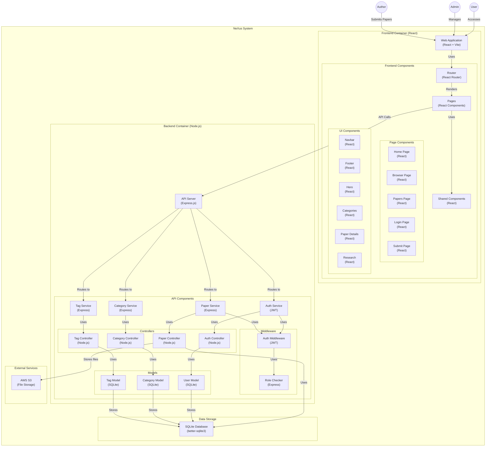

# Nexus: Research Paper Repository

# 🚀 Nexus: Research Paper Repository


## 📚 Project Documentation

| Directory | Documentation | Purpose |
|-----------|---------------|---------|
| [Controllers](/controllers-documentation) | [Controllers Documentation](src/controllers/controllers.md) | Request handling and business logic |
| [Config](/config-documentation) | [Config Documentation](/config-documentation) | System configuration and external services |
| [Routes](/routes.md) | [Routes Documentation](/routes.md) | API endpoint definitions |
| Models | Not available | Data access and database operations |
| Middleware | Not available | Request processing and authentication |

---

## Overview
Nexus is a research paper repository backend built with Node.js following the MVC (Model-View-Controller) architecture. This system allows users to browse, search, and upload research papers with appropriate categorization and tagging.

## System Architecture

Nexus follows a classic MVC architecture with clear separation of concerns:

1. **Models**: Data access layer interfacing with SQLite database
2. **Controllers**: Business logic handling HTTP requests and responses 
3. **Routes**: API endpoint definitions and routing
4. **Config**: System configuration and integrations
5. **Middleware**: Request processing and authentication




The backend connects to Backblaze B2 cloud storage (S3-compatible) for file storage and uses SQLite for database persistence.

```
nexus-backend/
├── controllers/     # Request handling logic
├── models/          # Data access layer
├── routes/          # API endpoint definitions
├── config/          # System configuration
├── middleware/      # Request processing
├── uploads/         # Local development uploads
└── server.js        # Application entry point
```

---

## User Roles

| Role | Permissions |
|------|-------------|
| `Admin` | Full system access, manage users, categories, tags |
| `Author` | Upload and manage own papers, assign tags |
| `User` | Browse and search papers (unauthenticated) |

---

## Authentication

Nexus uses JWT (JSON Web Token) authentication with the following characteristics:

- Token validity: 1 day
- Secure password storage using bcrypt
- Role-based access control for protected endpoints
- Client-side token management

---

## Data Models

### Main Entities
- **Users**: System users with roles (Admin/Author)
- **Papers**: Research paper documents with metadata
- **Categories**: Classification hierarchy for papers
- **Tags**: Keywords for enhanced searchability
- **Institutions**: Organizations associated with users

### Relationships
- A paper belongs to one category
- A paper can have multiple tags
- A paper can have multiple authors
- A user belongs to one institution

---

## 🖧 API Endpoints

Nexus exposes a RESTful API organized into logical groups:

### Auth API (`/api/auth/*`)
User registration, authentication, and session management

### Papers API (`/api/papers/*`)
Paper upload, retrieval, searching, and management

### Categories API (`/api/categories/*`)
Research category management

### Tags API (`/api/tags/*`)
Tag creation and assignment

### Dev Tools (`/dev/*`)
Development utilities for database management (admin only)

---

## External Integrations

### Backblaze B2 Storage
- S3-compatible cloud storage for research papers
- Public read access for downloaded papers
- Custom path structure: `research-papers/[timestamp]-[filename]`

---

## Security Considerations

- Password hashing with bcrypt (10 rounds)
- JWT for stateless authentication
- Role-based access control
- Input validation for all API endpoints
- File type validation for uploads

---

## Development Tools

### Local File Storage
Development mode supports local file storage in the `uploads` directory

### Database Management
Development endpoints for database reset, inspection, and restoration

---

## Data Flow

1. **Authentication Flow**:
   - User submits credentials
   - System validates and issues JWT
   - Token used for subsequent requests

2. **Paper Upload Flow**:
   - Authenticated author submits paper with metadata
   - File uploaded to B2 storage
   - Metadata stored in database with file URL
   - Tags and categories associated with paper

3. **Paper Retrieval Flow**:
   - User queries papers with optional filters
   - System returns paginated results (max 30 per page)
   - File URLs point to B2 for direct download

---

## Configuration Requirements

### Environment Variables
Required environment variables for system operation:

| Variable | Purpose | Example |
|----------|---------|---------|
| `PORT` | API server port | `3000` |
| `JWT_SECRET` | Secret for JWT signing | `your-secret-key` |
| `B2_ENDPOINT` | Backblaze B2 endpoint | `https://s3.us-west-004.backblazeb2.com` |
| `B2_KEY_ID` | B2 application key ID | `0011223344556677889900aab` |
| `B2_APPLICATION_KEY` | B2 application key | `K000abcdefghijklmnopqrstuvwxyz` |
| `B2_BUCKET_NAME` | B2 bucket name | `research-papers-bucket` |

---

## Getting Started

### Prerequisites
- Node.js (v14+)
- npm or yarn
- Backblaze B2 account (or local storage for development)

### Installation
1. Clone the repository
2. Install dependencies: `npm install`
3. Set up environment variables (see `.env.example`)
4. Initialize database: `npm run setup-db`
5. Start server: `npm start`

### Development Mode
Run with: `npm run dev`

---