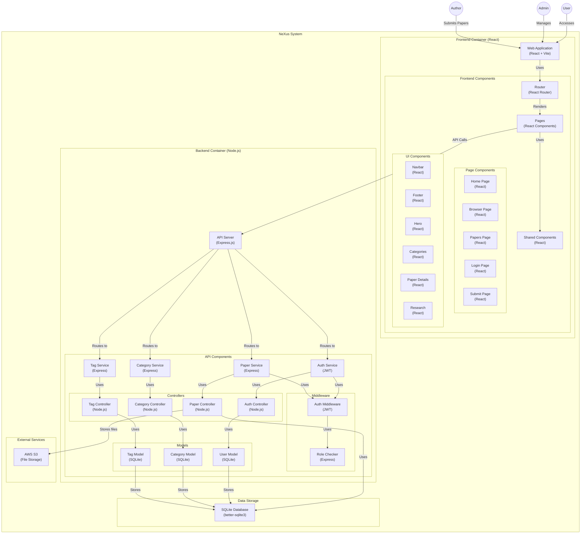

```mermaid
graph TB
    User((User))
    Admin((Admin))
    Author((Author))

    subgraph "NeXus System"
        subgraph "Frontend Container (React)"
            FrontendApp["Web Application<br>(React + Vite)"]
            
            subgraph "Frontend Components"
                Router["Router<br>(React Router)"]
                Pages["Pages<br>(React Components)"]
                SharedComponents["Shared Components<br>(React)"]
                
                subgraph "Page Components"
                    Home["Home Page<br>(React)"]
                    Browser["Browser Page<br>(React)"]
                    Papers["Papers Page<br>(React)"]
                    Login["Login Page<br>(React)"]
                    Submit["Submit Page<br>(React)"]
                end

                subgraph "UI Components"
                    Navbar["Navbar<br>(React)"]
                    Footer["Footer<br>(React)"]
                    Hero["Hero<br>(React)"]
                    Categories["Categories<br>(React)"]
                    PaperDetails["Paper Details<br>(React)"]
                    Research["Research<br>(React)"]
                end
            end
        end

        subgraph "Backend Container (Node.js)"
            APIServer["API Server<br>(Express.js)"]
            
            subgraph "API Components"
                AuthAPI["Auth Service<br>(JWT)"]
                PaperAPI["Paper Service<br>(Express)"]
                CategoryAPI["Category Service<br>(Express)"]
                TagAPI["Tag Service<br>(Express)"]
                
                subgraph "Middleware"
                    AuthMiddleware["Auth Middleware<br>(JWT)"]
                    RoleMiddleware["Role Checker<br>(Express)"]
                end

                subgraph "Controllers"
                    AuthController["Auth Controller<br>(Node.js)"]
                    PaperController["Paper Controller<br>(Node.js)"]
                    CategoryController["Category Controller<br>(Node.js)"]
                    TagController["Tag Controller<br>(Node.js)"]
                end

                subgraph "Models"
                    UserModel["User Model<br>(SQLite)"]
                    CategoryModel["Category Model<br>(SQLite)"]
                    TagModel["Tag Model<br>(SQLite)"]
                end
            end
        end

        subgraph "Data Storage"
            Database["SQLite Database<br>(better-sqlite3)"]
        end

        subgraph "External Services"
            S3Storage["AWS S3<br>(File Storage)"]
        end
    end

    %% User Interactions
    User -->|"Accesses"| FrontendApp
    Admin -->|"Manages"| FrontendApp
    Author -->|"Submits Papers"| FrontendApp

    %% Frontend Flow
    FrontendApp -->|"Uses"| Router
    Router -->|"Renders"| Pages
    Pages -->|"Uses"| SharedComponents
    Pages -->|"API Calls"| APIServer

    %% Backend Flow
    APIServer -->|"Routes to"| AuthAPI
    APIServer -->|"Routes to"| PaperAPI
    APIServer -->|"Routes to"| CategoryAPI
    APIServer -->|"Routes to"| TagAPI

    %% Middleware
    AuthAPI -->|"Uses"| AuthMiddleware
    PaperAPI -->|"Uses"| AuthMiddleware
    AuthMiddleware -->|"Uses"| RoleMiddleware

    %% Controllers
    AuthAPI -->|"Uses"| AuthController
    PaperAPI -->|"Uses"| PaperController
    CategoryAPI -->|"Uses"| CategoryController
    TagAPI -->|"Uses"| TagController

    %% Models
    AuthController -->|"Uses"| UserModel
    PaperController -->|"Uses"| Database
    CategoryController -->|"Uses"| CategoryModel
    TagController -->|"Uses"| TagModel

    %% Database
    UserModel -->|"Stores"| Database
    CategoryModel -->|"Stores"| Database
    TagModel -->|"Stores"| Database

    %% External Services
    PaperController -->|"Stores files"| S3Storage
```
